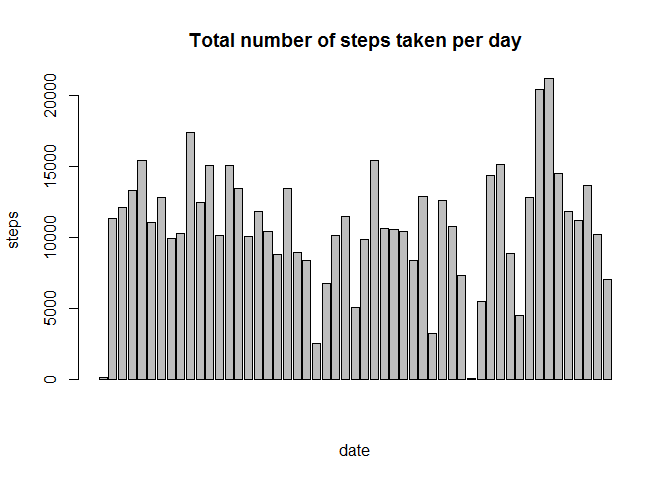
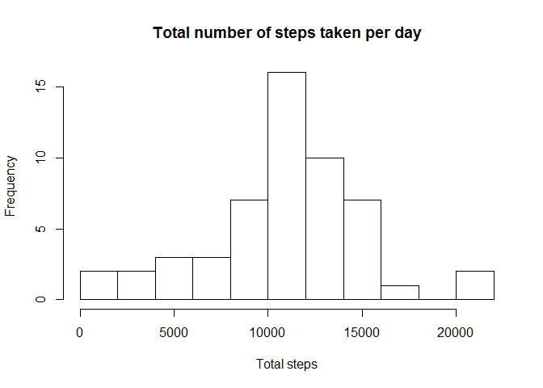
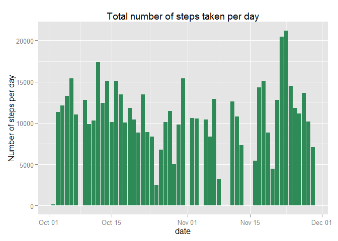
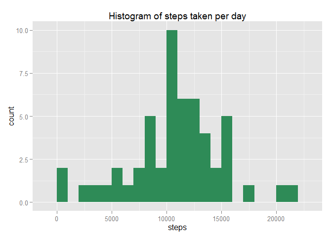
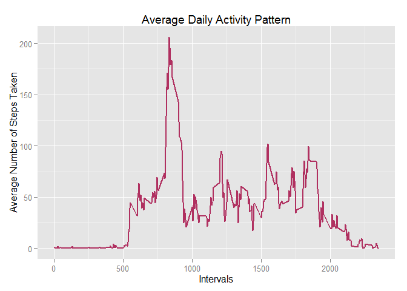
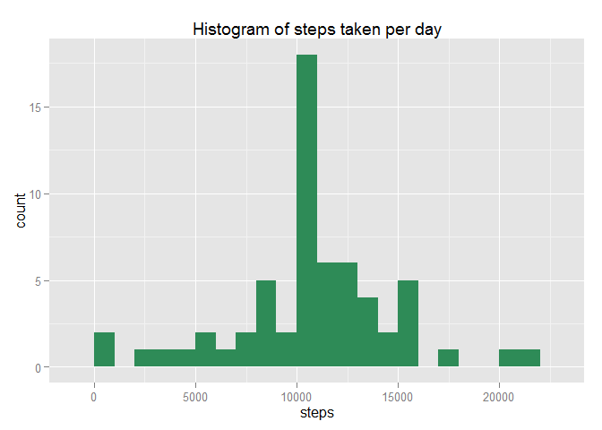
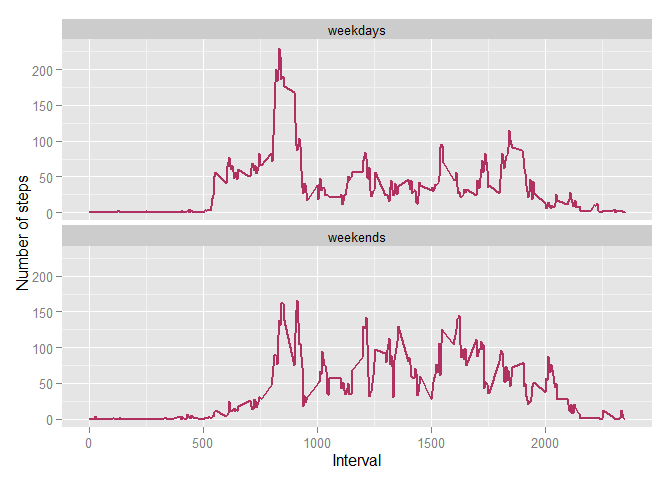

# Reproducible Research: Peer Assessment 1
## Loading the required libraries

```r
library(ggplot2)
```
## Loading and preprocessing the data

```r
unzip(zipfile="activity.zip")
activity <- read.csv("activity.csv")
activity$date <- as.Date(activity$date)
```

## What is mean total number of steps taken per day?

```r
TotalSteps <- aggregate(steps~date,activity,sum)
barplot(TotalSteps$steps,xlab="date",ylab="steps",main="Total number of steps taken per day")
```

 

```r
hist(TotalSteps$steps,breaks=15,main="Total number of steps taken per day",xlab="Total steps")
```

 

```r
g1 <- ggplot(TotalSteps,aes(x=date,y=steps))+
  geom_bar(fill="seagreen",stat="identity")+
  labs(y="Number of steps per day",x="date",title="Total number of steps taken per day")
g1
```

 

```r
g2 <- ggplot(TotalSteps,aes(x=steps))+
  geom_histogram(fill="seagreen",binwidth=1000)+
  labs(title="Histogram of steps taken per day")
g2
```

 

```r
summary(TotalSteps$steps)
```

```
##    Min. 1st Qu.  Median    Mean 3rd Qu.    Max. 
##      41    8841   10760   10770   13290   21190
```

```r
StepsMean <- mean(TotalSteps$steps, na.rm=TRUE)
StepsMedian <- median(TotalSteps$steps, na.rm=TRUE)
```
Mean and median of the total number of steps taken per day are 10766 and 10765,respectively
## What is the average daily activity pattern?

```r
StepsPerInterval <- aggregate(activity$steps,by=list(interval=activity$interval),
                              FUN=mean,na.rm=TRUE)
colnames(StepsPerInterval) <- c("interval","steps")
g3 <- ggplot(StepsPerInterval,aes(x=interval,y=steps))+
  geom_line(color="maroon",size=1)+
  labs(x="Intervals",y="Average Number of Steps Taken",title="Average Daily Activity Pattern")
g3
```

 

```r
MaxSteps <- StepsPerInterval[which.max(StepsPerInterval$steps),1]
```
The interval 835-840 contains the maximum number of steps

## Imputing missing values

```r
TotalMissing <- sum(is.na(activity$steps))
```
The total number of missing values are 2304

Replace missing values with the mean value at the same interval across days

```r
NoNA <- activity$steps
NAIndex <- which(is.na(activity))
NAReplace <- sapply(NAIndex,FUN=function(Idx){
  interval <- activity[Idx,]$interval
  StepsPerInterval[StepsPerInterval$interval==interval,]$steps
})
NoNA[NAIndex] <- NAReplace

NoNAData <- data.frame(steps=NoNA,date=activity$date,interval=activity$interval)

Total.Steps <- aggregate(steps~date,NoNAData,sum)
g4 <- ggplot(Total.Steps,aes(x=steps))+
  geom_histogram(fill="seagreen",binwidth=1000)+
  labs(title="Histogram of steps taken per day")
g4
```

 

```r
steps.mean <- mean(Total.Steps$steps)
steps.median <- median(Total.Steps$steps)
```
Both mean and median are 10766 

## Are there differences in activity patterns between weekdays and weekends?

```r
factors <- weekdays(NoNAData$date)
factors[!(factors%in%c("Saturday","Sunday"))] <- "weekdays"
factors[factors%in%c("Saturday","Sunday")] <- "weekends"
NoNAData <- cbind(NoNAData,factors)
weekdays.data <- subset(NoNAData,factors=="weekdays")
weekends.data <- subset(NoNAData,factors!="weekdays")

weekday.steps <- aggregate(weekdays.data$steps,by=list(interval=weekdays.data$interval),
                           FUN=mean)
colnames(weekday.steps) <- c("interval","steps")                          
weekend.steps <- aggregate(weekends.data$steps,by=list(interval=weekends.data$interval),
                           FUN=mean)
colnames(weekend.steps) <- c("interval","steps")    

weekday.steps$dayofweek <- rep("weekdays", nrow(weekday.steps))
weekend.steps$dayofweek <- rep("weekends", nrow(weekend.steps))
data.of.weekday <- rbind(weekday.steps, weekend.steps)

g5 <- ggplot(data.of.weekday,aes(x=interval,y=steps))+
  geom_line(color="maroon",size=1)+
  facet_wrap(~ dayofweek,nrow=2,ncol=1)+
  labs(x="Interval",y="Number of steps")
g5  
```

 


